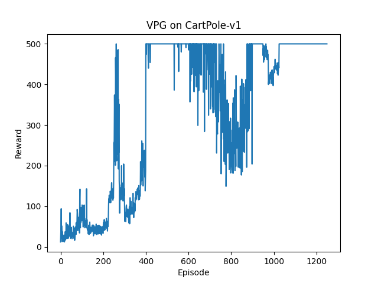
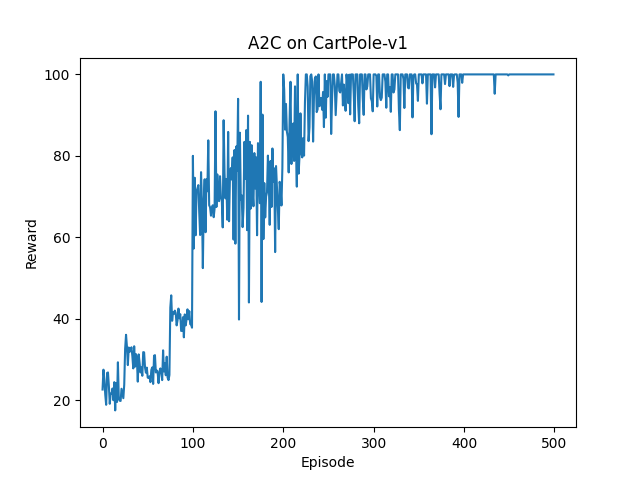

# deep-rl
:brain: Implementation of various Deep Reinforcement Learning algorithms.

These are implementations of different Deep Reinforcement Learning algorithms in PyTorch, as suggested by OpenAI's [Spinning Up in Deep RL](https://spinningup.openai.com/en/latest/index.html).

## Requirements

- Python 3.7+
- Install dependencies: `pip install -r requirements.txt`

## Algorithms

- Vanilla Policy Gradients (`vpg.py`)
- Deep-Q Networks (`dqn.py`)
- Advantage Actor-Critic (`a2c.py`)
- Proximal Policy Optimization (`ppo.py`)
- Deep Deterministic Policy Gradients (`ddpg.py`)

Note that the actual Neural Network models are defined in the module `agents.py`.

## Results

Agents were trained using each algorithm to solve two classic control Gym environments: `CartPole-v1` and `Pendulum-v0`. The first one was used with all algorithms except DDPG, which was trained against the second environment. The reason is that DDPG can only be used for continuous action spaces.

The following figure shows plots of the rewards obtained by each agent during training as well as a GIF of the trained agent interacting with the environment. Each plot and GIF can be found inside the `output/` directory.

<p align="center">
  
  
  
  
  
  
  
  
  
  
</p>

### Reproducing Results

To reproduce these results, you can run each algorithm separately by executing its file with the appropriate parameters. The models were setup to be able to run on either a CPU or a GPU. For example, to reproduce the DQN agent you can run:

```
python dqn.py --epochs 800 --max-steps 500 --buf-capacity 50000 --batch-size 32 --gamma 0.99 --alpha 0.0005 --initial-epsilon 1.0 --final-epsilon 0.1 --epsilon-decay 150.0 --eval-episodes 100 --verbose --save-gif
```

To find out what parameters are needed you can type `python [FILE] -h`.

## Issues

If you believe any of the implementations is wrong, or if you encounter any problems running the algorithms; let me know!
